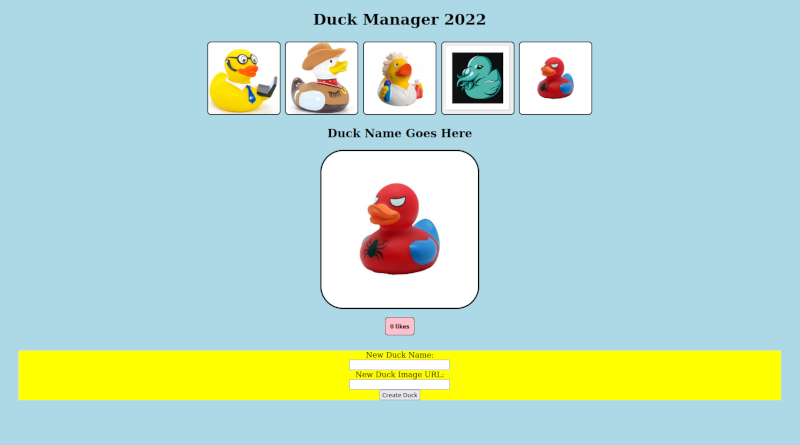

# Phase 1 Practice Code Challenge - Duck Manager



## Getting Started

Begin by opening the HTML with your browser of choice and running `json-server --watch db.json`.

For this challenge you'll be using the endpoint `http://localhost:3000/ducks`

## Deliverable One

When the page loads, fetch the ducks and display each duck image in the `#duck-nav`. You may need to do something to make sure your `script` tag is working in the HTML first...

## Deliverable Two

When a user clicks one of the duck images, it shows the duck's name, the image, and a likes button with the number of likes in the `#duck-display`like so:

```html
<div id="duck-display">

  <h2>Duck Shrute</h2>

  

  <button>3 likes</button>

</div>
```

If another image is clicked in the `#duck-nav` it replaces the previous name, image, and button with the proper content.

## Deliverable Three

When the likes button is clicked, it increments the number of likes displayed for that duck. Be sure that the button continues to read "X likes".

## Deliverable Four

When the `#new-duck-form` is submitted, it generates a new duck image in the `#duck-nav`. When clicked, it acts like the other images in the `#duck-nav` and shows a name, image, and like button in the `#duck-display`. No persistence is needed. A duck starts with 0 likes.
