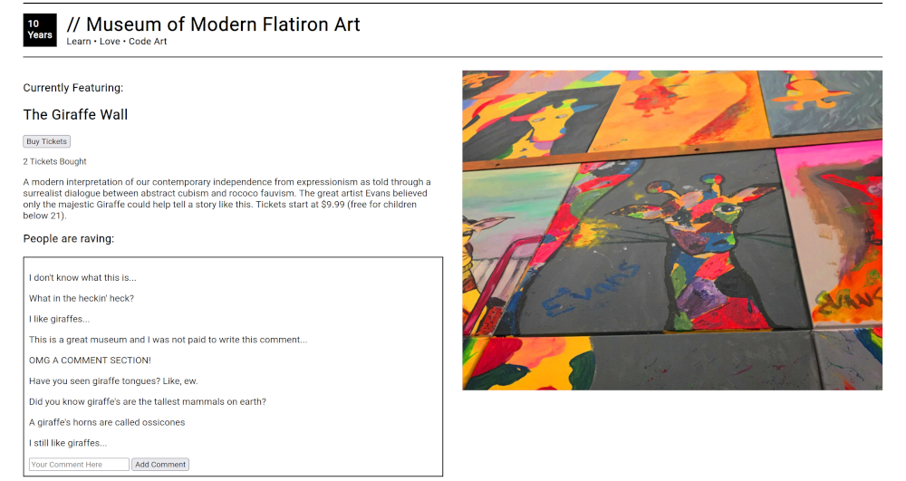

# Museum of Modern Flatiron Art

## Getting Started

Fork and clone this repository and then open it up in your favorite IDE. Open the `index.html` in your browser and start the server with `json-server --watch db.json`.

This challenge might feel different from other challenges so read the directions *carefully*.

## Deliverable One

Make a fetch to `http://localhost:3000/current-exhibits` and get the first exhibit fetched from the array. Add that exhibit's details to the areas that make sense on the page, for example the title should go in the element with the `exhibit-title` id.

For each comment attached to the exhibit, add it to the `comments-section` with a `p` element.

## Deliverable Two

When someone submits the form for a new comment, that comment gets added to the `comments-section` as a `p` tag.

## Deliverable Three

When someone clicks the `buy-tickets-button` it updates the `tickets-bought` element so that it increments the number of tickets. Make sure to retain the text, it shouldn't just say `1` but instead say `1 Tickets Bought`.

## BONUS One

When someone buys a ticket, PATCH the exhibit so it has the correct number of `tickets_bought`.

## BONUS Two

When someone makes a comment, PATCH the exhibit so its comments reflect the new comment added.
